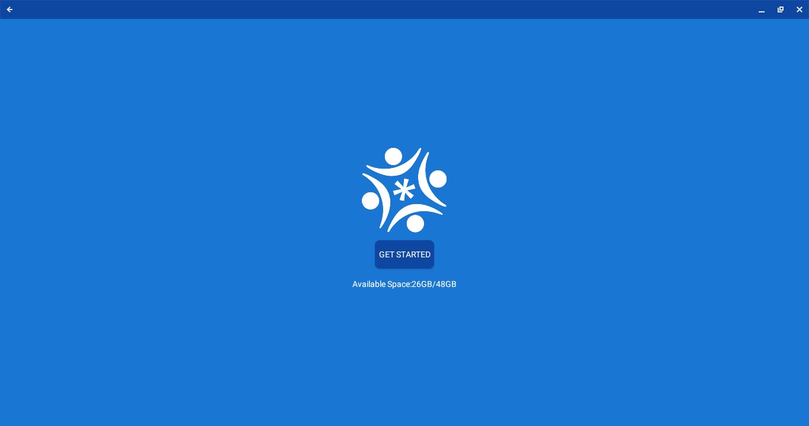

<h1 align="center">
   
  
   
  myPlanet
   
</h1>

<h4 align="center">An Android port of the <a href="https://github.com/open-learning-exchange/planet" target="_blank">Planet web application</a>, designed to facilitate access to educational resources in underserved communities.</h4>

 

  <a href="#key-features">Key Features</a> •
  <a href="#how-to-use">How To Use</a> •
  <a href="#license">License</a> •
  <a href="#contact">Contact</a>

  

## Key Features

- **Offline Access** - Download educational materials and access them without an internet connection.
- **Content Synchronization** - Sync with the Planet server to get the latest educational content.
- **Data Collection** - Collects usage data to help assess educational impact and user engagement.
- **AI Chatbot**: Provides an AI-powered chatbot to assist users with navigating the app, finding resources, and answering questions.
- **Collaboration and Sharing** - Supports collaborative learning and knowledge sharing.

## How To Use
 
1. Download and open the myPlanet app.
2. Allow the app to sync and sign up.
3. Browse available educational resources.
4. Download the resources that are needed for offline access.
5. Utilize the app's features to enhance your learning experience.

## License

This project is licensed under AGPL.

## Contact

For any questions or feedback, please contact us at solutions@ole.org.
